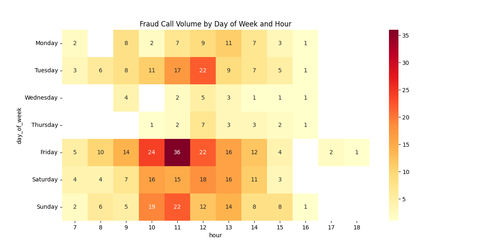
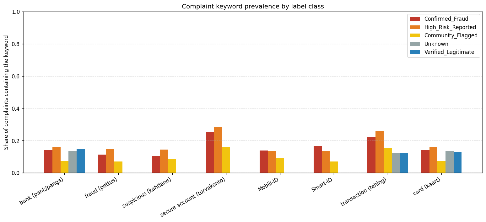
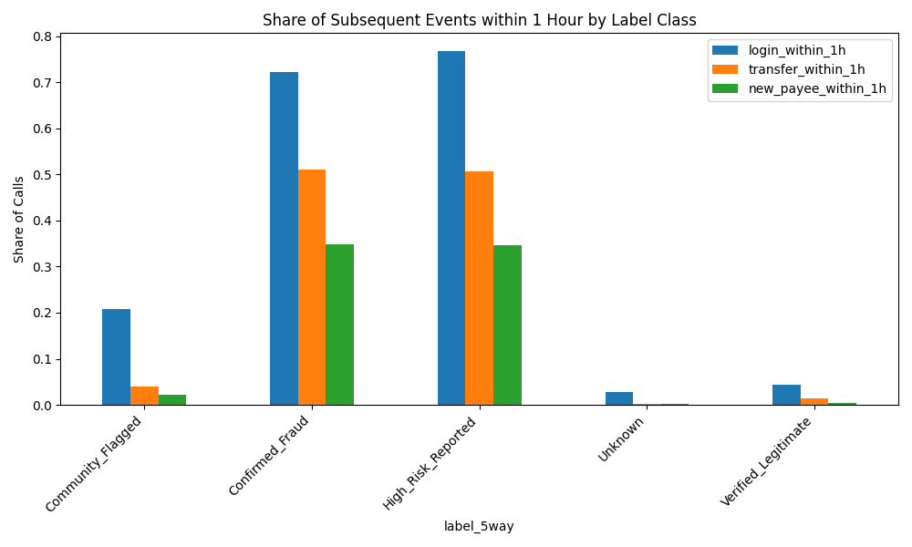
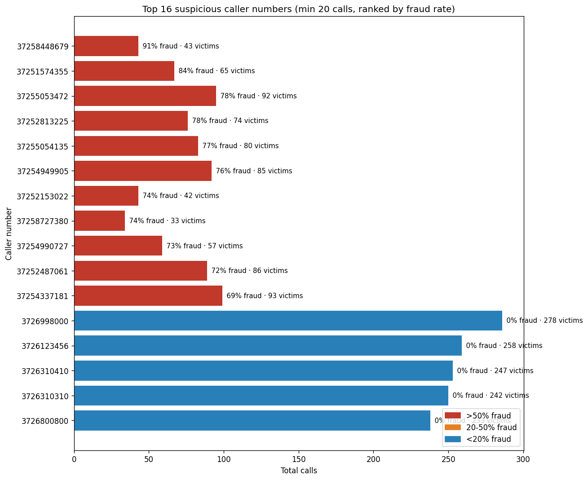
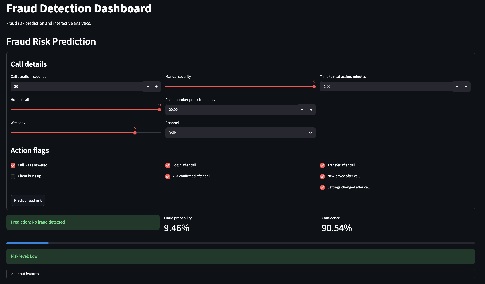
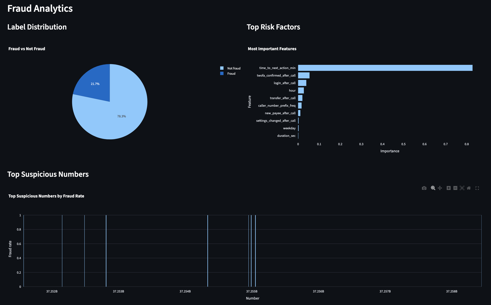

# Fake Bank Calls Fraud Detection

## Project Goal

The goal of this project was to develop and evaluate machine learning models capable of detecting fraudulent bank-related phone calls using behavioral, temporal, and complaint-based signals. The project focuses on identifying patterns commonly associated with social engineering attacks and fraudulent campaigns targeting banking customers.

The system was designed to analyze call events, customer actions following a call, complaint descriptions, and caller behavior in order to estimate the probability that a call was fraudulent. In addition to model development, the project included data preparation, exploratory analysis, feature engineering, model comparison, hyperparameter optimization, and deployment of an interactive dashboard for fraud risk assessment.

## Dataset

The project uses a synthetic dataset named `raw_bank_calls.csv`, created specifically for fraud detection research. The dataset simulates phone-call events occurring at an Estonian retail bank and contains both legitimate and fraudulent interactions.

The original dataset contains 5,151 records before cleaning. Following duplicate removal procedures, 5,000 records remained for analysis and modeling.

### Dataset Structure

The dataset combines three major information groups:

1. Call event information
2. Customer behavior after the call
3. Complaint and investigation information

Important variables include:

* Caller and customer phone numbers
* Call timestamps
* Call duration
* Call channel
* Customer authentication activity
* Money transfers
* New payee creation
* Security settings changes
* Complaint descriptions
* Manual severity ratings
* Fraud labels

Five fraud-related classes are represented:

* `confirmed_fraud`
* `high_risk_reported`
* `community_flagged`
* `unknown`
* `verified_legitimate`

The default dataset generation parameters include:

| Parameter       | Value |
| --------------- | ----- |
| Records         | 5000  |
| Fraud Rate      | 15%   |
| Fraud Campaigns | 50    |
| Seed            | 42    |

The dataset intentionally contains quality issues such as missing values, inconsistent category formatting, duplicate records, and multiple timestamp formats to simulate real-world data preparation challenges.

## Preprocessing

### Data Cleaning

Several data quality issues were addressed during preprocessing.

#### Missing Values

The following imputation strategies were applied:

| Column                  | Strategy  |
| ----------------------- | --------- |
| duration_sec            | Median    |
| manual_severity         | Median    |
| time_to_next_action_min | Median    |
| channel                 | "unknown" |
| complaint_text          | "unknown" |
| Behavioral flags        | False     |

These methods were selected to provide robust handling of missing information while preserving data consistency.

### Duplicate Removal

The dataset initially contained 5,151 records.

| Metric                   | Value       |
| ------------------------ | ----------- |
| Rows before cleaning     | 5151        |
| Exact duplicates removed | 103         |
| Near-duplicates removed  | 48          |
| Rows after cleaning      | 5000        |
| Total removed            | 151 (2.93%) |

Near-duplicates were defined as calls with matching caller, recipient, and timestamp information while having only minor variations in duration.

### Feature Engineering

Additional temporal and behavioral features were derived from the original dataset.

Temporal features included:

* Hour of day
* Day of week
* Business hours indicator
* Weekend indicator

Behavioral aggregation features included:

* `calls_from_number_last_24h`
* `distinct_victims_last_7d`
* `mean_call_duration_per_number`
* `complaint_keyword_score`

These engineered features were introduced during the final model improvement stage and significantly increased model performance.


## Models

Three supervised machine learning algorithms were evaluated.

### Model Comparison

| Model               | Accuracy | ROC-AUC | F1     | Precision | Recall | Latency (ms) |
| ------------------- | -------- | ------- | ------ | --------- | ------ | ------------ |
| Logistic Regression | 0.9333   | 0.9876  | 0.9009 | 0.8708    | 0.9330 | 3.01         |
| Random Forest       | 0.9696   | 0.9965  | 0.9522 | 0.9721    | 0.9330 | 103.43       |
| Gradient Boosting   | 0.9710   | 0.9977  | 0.9543 | 0.9766    | 0.9330 | 6.46         |

Gradient Boosting achieved the strongest overall performance and was selected as the primary model for further optimization.

### Hyperparameter Optimization

GridSearchCV was applied to the Gradient Boosting model.

#### Search Configuration

* Cross-validation: 3-fold
* Optimization metric: ROC-AUC

Parameters optimized:

* `n_estimators`
* `learning_rate`
* `max_depth`

#### Best Parameters

| Parameter     | Value |
| ------------- | ----- |
| learning_rate | 0.1   |
| max_depth     | 2     |
| n_estimators  | 200   |

Best cross-validation ROC-AUC:

**0.9983**

### Optimized Gradient Boosting Results

| Metric       | Value  |
| ------------ | ------ |
| Accuracy     | 0.9667 |
| ROC-AUC      | 0.9976 |
| F1           | 0.9471 |
| Precision    | 0.9763 |
| Recall       | 0.9196 |
| Latency (ms) | 6.36   |

Confusion Matrix:

```text
[[461   5]
 [ 18 206]]
```


## Results

### Exploratory Data Analysis

The exploratory analysis revealed several meaningful fraud indicators.

#### Fraud Call Frequency

Fraud calls demonstrated clear temporal clustering patterns throughout the week.



#### Complaint Keyword Analysis

Keywords such as *Mobiil-ID* and *Smart-ID* appeared frequently in fraud-related complaints and served as strong indicators of fraudulent activity.



#### Post-Call Behavioral Signals

Customer actions performed shortly after a call proved highly predictive.

Important events included:

* Internet banking login
* New payee creation
* Money transfers



#### Suspicious Caller Detection

Analysis identified high-volume caller numbers associated with large-scale fraud campaigns.



### Behavioral Feature Enhancement

The strongest model was retrained using additional aggregate behavioral features.

#### Additional Features

* calls_from_number_last_24h
* distinct_victims_last_7d
* mean_call_duration_per_number
* complaint_keyword_score

### Final Model Performance

| Metric       | Value  |
| ------------ | ------ |
| Accuracy     | 0.9913 |
| ROC-AUC      | 0.9999 |
| F1           | 0.9865 |
| Precision    | 0.9910 |
| Recall       | 0.9821 |
| Latency (ms) | 7.75   |

Confusion Matrix:

```text
[[464   2]
 [  4 220]]
```

### Improvement Over Baseline

| Metric    | Baseline | Enhanced Model | Improvement |
| --------- | -------- | -------------- | ----------- |
| Accuracy  | 0.9667   | 0.9913         | +0.0246     |
| ROC-AUC   | 0.9976   | 0.9999         | +0.0023     |
| F1        | 0.9471   | 0.9865         | +0.0394     |
| Precision | 0.9763   | 0.9910         | +0.0147     |
| Recall    | 0.9196   | 0.9821         | +0.0625     |

The largest improvement occurred in recall, reducing missed fraud cases from 18 to only 4. The additional behavioral features significantly improved the model's ability to identify fraud campaigns and suspicious caller behavior.


## Dashboard

A Streamlit dashboard was developed to demonstrate real-time fraud risk prediction.

The dashboard includes:

* Interactive fraud prediction form
* Risk probability calculation
* Feature-based prediction workflow
* Visual analytical summaries

### Dashboard Input Form



### Dashboard Visualizations



The dashboard enables users to enter call characteristics and receive an estimated fraud probability generated by the trained Gradient Boosting model.


## Limitations

Several limitations should be acknowledged.

1. The dataset is fully synthetic and does not contain real banking customer data.
2. Fraud patterns were intentionally embedded and are cleaner than real-world fraud behavior.
3. Number spoofing scenarios were not simulated.
4. Complaint texts are available only in Estonian.
5. Text diversity is limited due to a small number of complaint templates.
6. External intelligence sources and regulatory datasets were not incorporated.
7. The project focuses on binary fraud prediction and does not attempt detailed fraud type classification.

These limitations mean that additional validation would be required before deployment in a production banking environment.

---

## Future Work

Several improvements could further enhance the system.

1. Integration of real-world banking fraud datasets.
2. Addition of multilingual complaint processing for Estonian, English, and Russian.
3. Incorporation of caller reputation services and external threat intelligence feeds.
4. Development of advanced NLP models for complaint analysis.
5. Implementation of real-time streaming fraud detection.
6. Investigation of graph-based fraud detection techniques for campaign identification.
7. Support for spoofed-number detection.
8. Continuous model retraining using feedback from fraud analysts.

Future development in these areas could improve both detection accuracy and operational usefulness in real banking environments.


## Conclusion

This project successfully demonstrated the application of machine learning techniques for fraudulent bank call detection. Through data cleaning, exploratory analysis, feature engineering, model evaluation, and hyperparameter optimization, a highly accurate fraud detection system was developed.

The final Gradient Boosting model enhanced with aggregate behavioral features achieved:

* Accuracy: **99.13%**
* ROC-AUC: **0.9999**
* F1-score: **0.9865**
* Precision: **0.9910**
* Recall: **0.9821**

These results indicate that behavioral and temporal signals provide strong predictive power for identifying fraudulent phone calls and can serve as a foundation for future fraud prevention systems.
